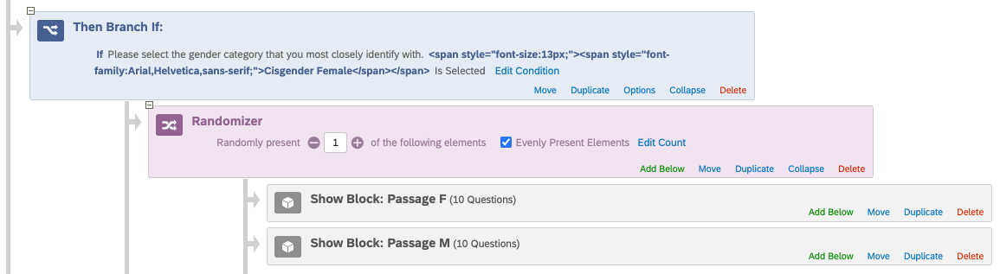
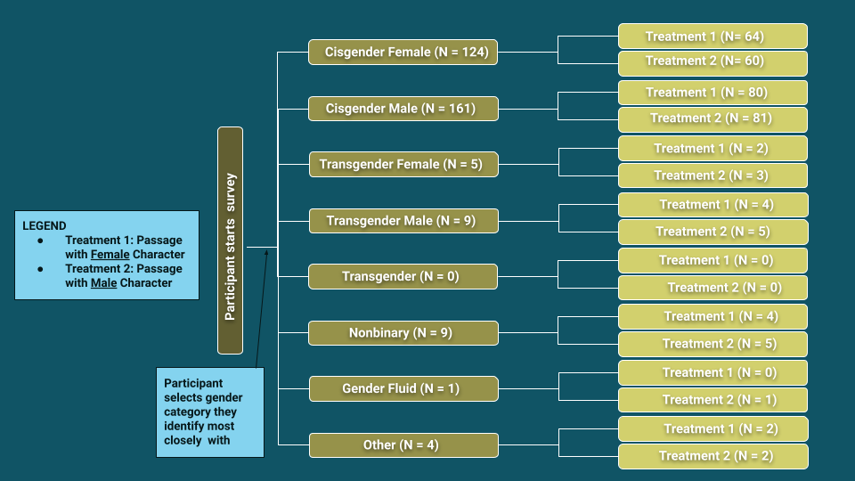
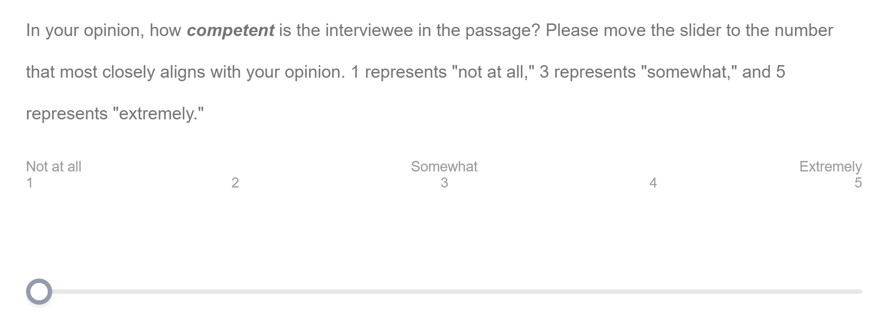
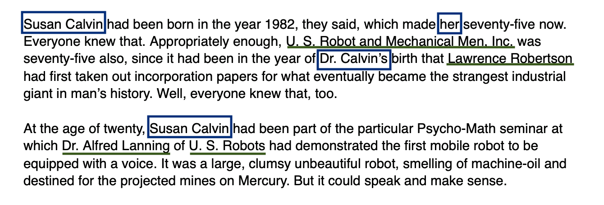
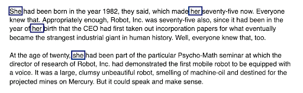
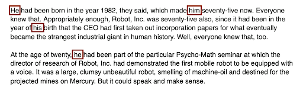

```{r setup, include=FALSE}
knitr::opts_chunk$set(echo = TRUE)
library(data.table)
library(knitr)
library(dplyr)
library(ggplot2)
library(lmtest)
library(patchwork)
library(stargazer)
```

# Abstract

# Introduction 
In the real world, humans and even machines sometimes report perceived differences between people of different genders that often align with gender stereotypes. These differences in manner and personality can also extend to perceptions about fictional characters in literature. Historically, the science-fiction and fantasy (SFF) genres in particular tend to be male-dominated in terms of authors, readership, and main characters (Flatt, 2018). This in conjunction with other factors has led some readers to observe that female main characters tend to be judged more harshly and along different criteria than their male counterparts in the genre (Konnikova, 2013). This raises the question: **Based on a science fiction character’s gender, are warmth and competence of the character and respect for them perceived differently?** The answer to this question would be valuable to discover because the SFF genre in particular has been found to influence the perceptions and acceptance of science by the public (Menadue & Jacups, 2018). If there is a relationship between gender and character perception in SFF, this might be one lens through which we can investigate gender in science and STEM fields. Ultimately, literature has the power to either amplify stereotypes or encourage empathy and open-mindedness, and understanding how readers respond to characters can reveal potential dynamics of bias in the genre.

We are conducting a randomized controlled experiment to allow us to investigate this causal question and determine whether or not there is strong evidence to support the idea that a character’s gender in SFF influences the perceptions of the readers. 

To address the research question, the hypotheses are the following. 
Null hypothesis: There is no difference in perception between male and female versions of the character, in terms of warmth, competence, and respect.
Alternative hypothesis: There is a difference in perception between male and female versions of the character, in terms of warmth, competence, and respect.

Based on existing gender stereotypes, our expectation is that, on average, female characters will be perceived as more warm and less competent and will be less respected than their male counterparts.

# Related Works
Prior research in the area of gender stereotypes and perception has evaluated the perceptions that people have of others using the Stereotype Content Model (Fiske, 2018), or SCM. The SCM defines Warmth (trustworthiness, sociability) and Competence (capability, agency) as two common dimensions by which people tend to make judgements about individuals or groups (Fiske, 2018). Prior research using the SCM has shown that many stereotypes about social groups can be broken down along these dimensions to reveal certain associated emotional responses to those groups. For example, groups that typically rate high in perceived Warmth but low in perceived Competence (e.g. children, the elderly) often evoke emotions such as pity or sympathy, etc. In real life, researchers have observed differences between how men and women are perceived along these dimensions and how that can impact their social interactions. For example, one study found that perceived confidence in men in the workplace is correlated with their perceived Competence, whereas for women confidence and Competence are only correlated when they are also perceived as Warm (Mayo, 2016). Within gender categories, the Warmth-Competence scale has also shown distinctions between different “types” of men and women (Fiske, 2002). For example, “housewives” tend to receive high Warmth-low Competence scores, meanwhile “businesswomen” receive the opposite (low-high). For our experiment, we applied a similar evaluation scale to the context of SFF literature to examine gender bias.

# Experiment

To address the research question, we carried out the experiment through a survey we created on Qualtrics. As part of the survey, each participant will be given a short SFF passage to read followed by questions about their perceptions of the main character in the passage. We enabled a survey protection feature that prevents participants from taking the survey more than once. 

## Treatment

In an ideal setting, we would be able to gather responses to a novel or other real work of fiction by creating two versions with the same story except for the gender of the main character; however, recruiting participants to read a full-length novel would take too long and introduces the possibility that some respondents may have already read the work or are aware of the original character’s gender. Instead, we looked for an engaging passage (roughly 1000 words and about a 5 minute read) from a reputable author in the SFF genre. This passage should not be the climax of the story since it would be too easy for respondents familiar with the SFF genre to recognize the work. We used the introduction of I, Robot by Isaac Asimov because it fit all the criteria we were looking for: reputable author and story, short enough, and interesting yet not the main action of the full novel. The original passage is an interview with the main character, Susan Calvin, about her life’s work with robots and her retirement. We created two versions of the passage that signal different gender identities for the main character through gender pronouns, and half of the participants of the study will be randomly assigned to read the version of the passage that uses typically masculine pronouns (he/his), while the other half will read the version of the passage that uses typically feminine pronouns (she/hers). The passage only refers to the main character through gender pronouns because we didn’t want the character name to bring up unconscious name biases. We also replaced any notable details such as specific sci-fi phrases only Asimov uses, company names, supporting character names that would likely lead someone to recognize the passage. Aside from the character’s pronouns, the content of the passages were the same for the two different passages. We wanted to avoid priming participants to be more aware or sensitive to the character’s gender before reading the passage, therefore we excluded explanations of the treatment and control conditions from the study description.

An excerpt from the original piece and excerpts from the two treatment passages we constructed from it are displayed in Appendix 1.  

## Comparison Of Potential Outcomes

  $R$  $X_F$   $O$

  $R$  $X_M$   $O$
  
Our research design can be described using the above ROXO notation. This is a Posttest Only Randomized Experiment where we are using a between subjects comparison to observe the differences between subjects who will see only one variation of the treatment. We will begin with using blocked random assignment (R) to assign participants to either the female passage treatment group or the male passage treatment group. Members of each group will then be given the passage associated with their group (XF, XM) and evaluated for their perception of the main character’s warmth, competence, and respectability after reading. As participants will have no way of knowing about the main character beforehand, we can only evaluate them after the treatment has been given.  

## Randomizaton Process

In the pilot survey, we used simple random assignment. Each participant had an equal probability of being assigned Treatment 1 (Passage with Female Character) and Treatment 2 (Passage with Male Character).

In the final survey, we used block random assignment, wherein we blocked by participant gender. Towards the beginning of the survey, the participant is presented with 8 gender categories and asked to select the one they most closely identify with. Based on their selection, they are assigned either Treatment 1 or Treatment 2, in such a way that within each gender category, assignments are evenly distributed between Treatment 1 and Treatment 2. This was specified by conditionals implemented in Survey Flow in our Qualtrics surveys --- a conditional as shown below, for each of the following gender categories: *Cisgender Female*, *Cisgender Male*, *Transgender Female*, *Transgender Male*, *Transgender*, *Nonbinary*, *Gender Fluid*, *Other*.



The motivation for blocking by participant gender in the final study was because we anticipated heterogeneous treatment effects based on this variable. Specifically, we anticipated a possible relationship between one’s gender and how one rates a character of a particular gender. For example, male participants might tend to rate the male character more highly than the female character; similarly, female participants might tend to rate the female character more highly than the male character. Thus, the treatment effect may vary considerably between participants of one gender category and participants of another gender category. If most participants of a particular category are assigned the same treatment, the outcomes of each treatment group would be polarized. Blocking by participant gender would help avoid that, as participants of each gender category would be evenly assigned to the treatments.



As displayed by the consort diagram above, the blocking worked, and we were able to achieve near-perfect even distribution of treatment assignment per participant gender category. For the categories where there is a difference of 1 between the number of participants of that category assigned to Treatment 1 and the number of participants of that category assigned to Treatment 2, that is due to the number of participants of that category being odd. For the categories where the difference is greater than 1, that is due to attrition. 

## Outcome Measures

To track whether readers make similar distinctions in judgment when it comes to fictional characters, we adapted the Warmth-Competence measures from the Stereotype Content Model to assess how character gender impacts reader perceptions. 



After reading the passage, participants were asked a series of questions to gauge their perception of the main character. These questions were of the form: In your opinion, how _________ is the interviewee in the passage? The blanks will be replaced by either Warmth terms (warm and well-intentioned) or Competence terms (competent and capable). We included an additional question asking, “How much do you respect the interviewee in the passage?” to consider an additional dimension of the character and any insights it may provide from if correlated with the other variables. As shown in Figure 3, participants’ responses will be recorded on a 5-point Likert scale, where 1 is “not at all” and 5 is “extremely” (Fiske et al., 2002). 

The variables Warmth and Competence will be calculated by taking the average responses of the associated questions. For example, someone who answered “3” for “In your opinion, how warm is the interviewee in the passage?” and “5” for “In your opinion, how well-intentioned is the interviewee in the passage?” will have a “Warmth” value of 4. Taking the average of multiple variables to calculate Warmth and Competence will allow us to treat Warmth and Competence as continuous variables when running the following tests and regressions instead of as ordinal variables. The Respect variable will be directly taken from responses to the question “How much do you respect the interviewee in the passage?” and remain as an ordinal variable. In total, we will have three metrics by which we will evaluate participants: Warmth, Competence, and Respect. 

## Covariates

In addition to being randomly assigned a version of the passage to read, participants were evenly blocked according to their gender to reduce the potential for the reader’s gender to introduce major variations in character perception. Further covariates that we collected included basic information about the participant (i.e. gender, age, education) and the participant’s reading habits (i.e. How much do you enjoy reading compared to doing other things? How much do you like science fiction and fantasy compared to other things you read?). We used the information about reading habits to investigate potential correlations between past experience with the genre and character perception; if there are differences between how experienced and inexperienced SFF readers respond, this might be an indication that the two groups have some fundamental differences in how they understand gender in SFF due to their reading habits. 

To assess whether participants are actually responding to passage, we also added comprehension/recall questions that demonstrated the participant’s understanding of the reading immediately after they were shown to passage. Specifically, we asked them the following (in the final study): 
* What does the interviewer think the interviewee never does?
* What does the interviewee suggest the interviewer has not experienced?
* What is the interview being conducted for?
The correct answers to these questions were explicitly stated in the passage and should have been clear to respondents who read the text comprehensively according to the survey instructions. The effectiveness of these comprehension questions was confirmed by the [insert stat about Slack/e-mail respondents]. Additionally, we also asked them “Did the passage look familiar to you?” to see if the familiarity of the passage or having read the full text was correlated with responses that differed from people who were reading the passage for the first time, as well as the effectiveness of our efforts in ambiguating the passage. 

# Pilot Study

## Pilot Study Participants
Participants of the pilot study were recruited through reaching out to friends and family and posting in our 5th year MIDS cohort Slack channel. So participants of the pilot study were mainly friends, family, and cohort members. There were 27 participants in total.

## Pilot Data

```{r}
# loading pilot data
d_pilot <- data.table::fread(input = 'pilot_data.csv')
```

```{r}
# viewing first 6 rows of pilot data
head(d_pilot)
```

```{r}
plot_bars_by_gender <- function(outcome_col, passage_gender) {
  outcome_plot <- ggplot() +
    geom_bar(aes(x=outcome_col, fill=passage_gender), position="dodge", alpha=0.8) + 
    scale_fill_manual(name="Character Gender", labels=c("Female","Male"), values=c("coral", "cornflowerblue")) +
    theme(panel.grid.minor.x=element_blank(), panel.grid.major.x=element_blank()) +
    xlim(0.5, NA) +
    ylim(0, 95)
  return(outcome_plot)
}
```

The distribution of each outcome measure in the pilot data is displayed in Appendix 2.

## Power Calculation

```{r}
# create a column that represents `warmth` by averaging `warm` rating and `well-intentioned` rating
d_pilot$warmth <- (as.numeric(d_pilot$warm) + as.numeric(d_pilot$well_intentioned)) / 2
# create a column that represents `competence` by averaging `competent` rating and `capable` rating
d_pilot$competence <- (as.numeric(d_pilot$competent) + as.numeric(d_pilot$capable)) / 2
```

```{r}
d_pilot[passage_gender == 'PassageF', warmth]
```

```{r}
# function to get the outcomes using a specified metric for a specified treatment group
get_outcomes <- function(treatment, column_name) {
  if (column_name == 'warmth') {
    return(d_pilot[passage_gender == treatment, warmth])
  } else if (column_name == 'competence') {
    return(d_pilot[passage_gender == treatment, competence])
  } else if (column_name == 'respect') {
    return(d_pilot[passage_gender == treatment, respect])
  }
}

# function to get the difference of means of an outcome variable
diff_means_gender <- function(column_name){
  female_outcomes <- get_outcomes('PassageF', column_name)
  male_outcomes <- get_outcomes('PassageM', column_name)
  
  female_mean <- mean(female_outcomes)
  male_mean <- mean(male_outcomes)
  
  diff_means <- female_mean - male_mean
  return(diff_means)
}

# function to get the pooled standard deviation of an outcome variable
pooled_sd_gender <- function(column_name){
  female_outcomes <- get_outcomes('PassageF', column_name)
  male_outcomes <- get_outcomes('PassageM', column_name)
  
  n1 <- length(female_outcomes)
  n2 <- length(male_outcomes)
  
  sd1 <- sd(female_outcomes)
  sd2 <- sd(male_outcomes)
  
  pooled <- (((n1 - 1)*sd1**2 + (n2-1)*sd2**2)/(n1+n2-2))**(1/2)
  return(pooled)
}
```

```{r}
# get the difference of means and pooled sd for outcome variable
diff_mean_warmth <- diff_means_gender('warmth')
pooled_sd_warmth <- pooled_sd_gender('warmth')
diff_mean_competence <- diff_means_gender('competence')
pooled_sd_competence <- pooled_sd_gender('competence')
diff_mean_respect <- diff_means_gender('respect')
pooled_sd_respect <- pooled_sd_gender('respect')
```

```{r}
# sample size for warmth for power of 0.8
power.t.test(power = .8,delta= diff_mean_warmth,sd=pooled_sd_warmth,sig.level=0.05,
        type="two.sample",alternative="two.sided",strict = TRUE)
```

```{r}
# sample size for competence for power of 0.8
power.t.test(power = .8,delta= diff_mean_competence,sd=pooled_sd_competence,sig.level=0.05,
        type="two.sample",alternative="two.sided",strict = TRUE)
```

```{r}
# sample size for respect for power of 0.8
power.t.test(power = .8,delta= diff_mean_respect,sd=pooled_sd_respect,sig.level=0.05,
        type="two.sample",alternative="two.sided",strict = TRUE)
```

Doing a pilot study was a way to see if our study was reasonable and if there were any changes we needed to make before we released our final study. We conducted power calculations on the pilot study data to predict the appropriate sample size needed in our final study. We calculated for a power of 0.8 for all three outcome variables and got varying results for what sample size was necessary. We set a power of 0.8 because it was the standard in research and we thought an 80% probability of detecting an effect, given that the effect is really there was a high enough probability. Our final study will conduct t-tests of our outcome variables since we would have a sample larger than 30 respondents so we also used the power calculations on a t-test to be consistent with our final study. We computed the difference in means and pooled standard deviation of our metrics: warmth, competence, and respect to input into the power calculation. We needed 1550 respondents in total (775 respondents for each treatment) to have a power of 0.8 for our warmth metric that had a difference in mean of 0.08. With an even smaller difference in means (0.02) for our competence variable we would have needed 46,464 total respondents. Both of these sample sizes were unreasonable in the time and resources we had available to gather responses. However, our respect variable had a difference in means of 0.6 and with a power of 0.8 we would need only 100 total respondents (50 respondents in each treatment). This result gave us hope that if we could get at least 100 respondents we would have enough power to be confident in our results if we end up rejecting the null hypothesis in the final study. 

## Changes From Pilot Study To Final Study
A handful of changes were made to the survey after the pilot study. First, we shifted to blocked random assignment by participant gender instead of simple random assignment. The motivation for this was discussed earlier in the randomization section of the report. Additionally, we added more instructions at the beginning of the survey --- participants were told to do their best to complete the survey in one sitting and that the survey would take approximately 10 minutes. This was done to motivate them to take the survey since it should not take more than 10 minutes and to encourage them to complete the survey sooner rather than later.

We also added a question asking for education level, which we thought would be a relevant covariate, as it would help inform us on participants’ reading levels, which can impact how they perceive characters. Moreover, we addressed the ambiguity in the third post-treatment attention check question, which at the time had read “What has the interviewer not experienced” and rephrased it to “What does the interviewee suggest the interviewer has not experienced?” We underlined the word “interviewee” to explicitly set it apart visually from the word “interviewer” in every place where both words were in the same question. Furthermore, we lowered the number of page breaks from 4 to 2 in order to keep participants more engaged and feel less intimidated by the number of steps to complete the survey. 

Lastly, we disabled the back button so that participants cannot change their answers back and forth and that they respond to the post-treatment questions from their memory of the passage they read. 

# Final Study

## Final Study Participants

There were 313 participants total in the final study. We aimed to collect as many responses as possible. We created two Qualtrics surveys, one for distributing to MTurk and the other for distributing to UC Berkeley School of Information Slack channels and University English Departments across California. The only difference between the two is the generation of a completion code that is required for MTurk, as a way to confirm which MTurk workers have completed the survey and thus are eligible for pay. Our budget of $500 informed how many responses we could pay to get from MTurk, so we requested the maximum number of responses we could afford. We received 240 responses from MTurk, all of which were complete.

We received 106 responses from UC Berkeley School of Information Slack members and University English Department members collectively, 73 complete responses and 33 incomplete responses. All of the participants who gave incomplete responses did not answer the post-treatment questions, so they chose to leave the survey either right after answering the pre-treatment (covariate) questions or right after seeing their assigned passage. 

To recruit participants from Slack, we posted to the School of Information program-specific channels (#mids-announcements, #mims-announcements, #mics-announcements), as well as a general channel that anyone in that Slack workspace could be in (#noise). 

To recruit participants from University English Departments across California, we scraped email addresses of department chairs and advisors at 144 universities. And we schedule sent emails to half of them on Tue, Mar 16, 7:48 AM and to the other half of them Wed, Mar 17, 7:48 AM. We emailed them the survey information and asked them to forward it to faculty and students in their department. 

We reached out to peers on Slack and University English Departments after getting the maximum responses from MTurk, in order to achieve a larger sample size and recruit people who are more likely to be invested in participating and willing to read a passage without pay. 

The messages we wrote in Slack and over email are documented in Appendix 3. 

## Final Data

```{r}
# loading final data
d_final <- data.table::fread(input = 'final_data.csv')
```

```{r}
# viewing first 6 rows of final data
head(d_final)
```

```{r}
# create a column that represents `warmth` by averaging `warm` rating and `well-intentioned` rating
d_final$warmth <- (as.numeric(d_final$warm) + as.numeric(d_final$well_intentioned)) / 2

# create a column that represents `competence` by averaging `competent` rating and `capable` rating
d_final$competence <- (as.numeric(d_final$competent) + as.numeric(d_final$capable)) / 2
```

```{r}
# shorten phrases for education levels
d_final <-  d_final %>%
  mutate(educ_short = case_when(
    education == "Bachelor’s degree" ~ "Bachelor's",
    education == "Master’s degree" ~ "Master's",
    education == "High school graduate, diploma or the equivalent (for example: GED)" ~ 'HS',
    education == "Associate degree" ~ 'Assoc.',
    education == "Doctorate degree" ~ 'PhD'))
```

The distribution of each outcome measure and distribution of each covariate in the final data are displayed in Appendix 4. 

# Initial Results

To analyze our results, we will take the average Warmth rating and Competence rating for each participant from the Warmth-specific and Competence-specific questions respectively. We will compare these average Warmth and Competence ratings between the group that read the passage with a male main character and the group that read the passage with a female main character. We plan to test whether there are significant differences between the average measures for the two groups that can be attributed to the character’s gender. 

## Difference In Means

```{r}
# difference in means for `warmth`
test_warmth <- t.test(warmth ~ passage_gender, data = d_final, paired = FALSE)
test_warmth

# difference in means for `competence`
test_competence <- t.test(competence ~ passage_gender, data = d_final, paired = FALSE)
test_competence

# difference in means for `respect`
test_respect <- t.test(respect ~ passage_gender, data = d_final, paired = FALSE)
test_respect
```

```{r}
str(test_warmth)
```

```{r}
test_warmth$conf.int[1]
test_warmth$conf.int[2]

(test_warmth$conf.int[2] - test_warmth$conf.int[1]) / 3.92
```

The average `warmth` rating given to the female character was `r test_warmth$estimate[1]` and the average `warmth` rating given to the male character was `r test_warmth$estimate[2]`. The average treatment effect with the `warmth` metric (the average difference in perceived `warmth` between female character and male character) is `r test_warmth$statistic`. This test resulted in a p-value of `r test_warmth$p.value` and standard error of `r (test_warmth$conf.int[2] - test_warmth$conf.int[1]) / 3.92`.

The average `competence` rating given to the female character was `r test_competence$estimate[1]` and the average `competence` rating given to the male character was `r test_competence$estimate[2]`. The average treatment effect with the `competence` metric (the average difference in perceived `competence` between female character and male character) is `r test_competence$statistic`. This test resulted in a p-value of `r test_competence$p.value` and standard error of `r (test_competence$conf.int[2] - test_competence$conf.int[1]) / 3.92`.

The average `respect` rating given to the female character was `r test_respect$estimate[1]` and the average `respect` rating given to the male character was `r test_respect$estimate[2]`. The average treatment effect with the `respect` metric (the average difference in perceived `respect` between female character and male character) is `r test_respect$statistic`. This test resulted in a p-value of `r test_respect$p.value` and standard error of `r (test_respect$conf.int[2] - test_respect$conf.int[1]) / 3.92`.

The effect size for `respect` was largest, which indicates that the difference between how much respect participants have for the female character and how much respect participants have for the male character was largest, compared to the differences in the other metrics of perception (`warmth` and `competence`). 

The effect direction is positive for all three metrics (`warmth`, and `competence`, and `respect`), which indicates that on average, the female character was given higher ratings than the male character, along the three metrics. This does not completely align with our expectations --- while we did expect the female character’s warmth rating to be higher than the male character’s on average, we did not expect the female character’s competence and respect ratings to also be higher than the male character’s on average. 

## Linear Regression

```{r}
null_model <- d_final[ , lm((as.numeric(d_final$passage_gender) - 1) ~ 1)]
full_model <- d_final[ , lm((as.numeric(d_final$passage_gender) - 1) ~ 1 + gender + age + education + enjoy_reading + books + sci_fi)]
cov_balance_check <- anova(null_model, full_model, test='F')
```

Before examining our regression results, we performed a covariate balance check to test for inconsistencies in our randomization scheme. To compare a null intercept-only model to a full model with the covariate information we collected, we conducted an F-test to analyze the amount of additional variance explained by the full model. With a p-value of `r cov_balance_check$"Pr(>F)"`, we failed to reject the null hypothesis that the full model with covariates explains a significant amount of variance in the data compared to the null model.

```{r}
warmth_model <- d_final[ , lm(warmth ~ passage_gender + gender + age + education + enjoy_reading + books + sci_fi)]
warmth_model$vcovHC_ <- vcovHC(warmth_model, type="HC0")
competence_model <- d_final[ , lm(competence ~ passage_gender + gender + age + education + enjoy_reading + books + sci_fi)]
competence_model$vcovHC_ <- vcovHC(competence_model, type="HC0")
respect_model <- d_final[ , lm(respect ~ passage_gender + gender + age + education + enjoy_reading + books + sci_fi)]
respect_model$vcovHC_ <- vcovHC(respect_model, type="HC0")
```

```{r, echo=FALSE, results='asis', warning=FALSE}
stargazer(
  warmth_model, 
  competence_model, 
  respect_model, type="text", se = list(sqrt(diag(warmth_model$vcovHC_)),
                                      sqrt(diag(competence_model$vcovHC_)), 
                                      sqrt(diag(respect_model$vcovHC_))), 
  covariate.labels = c("Treatment (male passage)", "Block: Cisgender Male", "Block: Gender Fluid", "Block: Nonbinary", "Block: Other", "Block: Transgender Female", "Block: Transgender Male", "Age", "Bachelor's degree", "Doctorate degree", "High school/GED", "Master's degree", "Enjoy reading", "Books read", "Enjoy sci-fi"))
```


# Exploration

## Exploratory Regression

## Motivation For Exploratory Filtration Of Data

```{r warning=FALSE}
# MTurk participants tend to take less time to complete the survey
duration_plot <- ggplot(data=d_final) +
  geom_histogram(aes(x=duration, fill=source), position="identity", alpha=0.8, binwidth = 60) + 
  labs(title="Duration by Source", x="Duration (seconds)", y="Count") +
  scale_fill_manual(name="Source", labels=c("MTurk","Slack/E-mail"), values=c("darkorange", "darkolivegreen4")) +
  theme(panel.grid.minor.x=element_blank(), panel.grid.major.x=element_blank(), legend.position = "none") +
  xlim(0, 1000)

# MTurk participants tend to answer less attention checks correctly
check_pass_plot <- ggplot(data=d_final) +
  geom_histogram(aes(x=check_pass, fill=source), position="dodge", alpha=0.8, binwidth = 0.5) + 
  labs(title="Attn. Checks Passed by Source", x="Attn. Checks Passed (out of 3)", y="Count") +
  scale_fill_manual(name="Source", labels=c("MTurk","Slack/E-mail"), values=c("darkorange", "darkolivegreen4")) +
  theme(panel.grid.minor.x=element_blank(), panel.grid.major.x=element_blank())
duration_plot | check_pass_plot
```

```{r}
d_final[ , .(mean_warmth = mean(warmth), mean_competence = mean(competence), prop_recognized = mean(recognize_passage == 'Yes')), keyby=.(passage_gender, source)]
```


## Exploratory Filtration of Data

```{r}
# filter data to only include responses coming from Slack or Email
d_filtered <-  d_final %>% filter(source == "slack_email")
```


## Results From Filtered Data

### Difference In Means On Filtered Data

```{r}
# difference in means for `warmth` on filtered data
test_warmth_filtered  <- t.test(warmth ~ passage_gender, data = d_filtered, paired = FALSE)
test_warmth_filtered 

# difference in means for `competence` on filtered data
test_competence_filtered <- t.test(competence ~ passage_gender, data = d_filtered, paired = FALSE)
test_competence_filtered

# difference in means for `respect` on filtered data
test_respect_filtered <- t.test(respect ~ passage_gender, data = d_filtered, paired = FALSE)
test_respect_filtered
```

The average `warmth` rating given to the female character was `r test_warmth_filtered$estimate[1]` and the average `warmth` rating given to the male character was `r test_warmth_filtered$estimate[2]`. The average treatment effect with the `warmth` metric (the average difference in perceived `warmth` between female character and male character) is `r test_warmth_filtered$statistic`. This test resulted in a p-value of `r test_warmth_filtered$p.value` and standard error of `r (test_warmth_filtered$conf.int[2] - test_warmth_filtered$conf.int[1]) / 3.92`.

The average `competence` rating given to the female character was `r test_competence_filtered$estimate[1]` and the average `competence` rating given to the male character was `r test_competence_filtered$estimate[2]`. The average treatment effect with the `competence` metric (the average difference in perceived `competence` between female character and male character) is `r test_competence_filtered$statistic`. This test resulted in a p-value of `r test_competence_filtered$p.value` and standard error of `r (test_competence_filtered$conf.int[2] - test_competence_filtered$conf.int[1]) / 3.92`.

The average `respect` rating given to the female character was `r test_respect_filtered$estimate[1]` and the average `respect` rating given to the male character was `r test_respect_filtered$estimate[2]`. The average treatment effect with the `respect` metric (the average difference in perceived `respect` between female character and male character) is `r test_respect_filtered$statistic`. This test resulted in a p-value of `r test_respect_filtered$p.value` and standard error of `r (test_respect_filtered$conf.int[2] - test_respect_filtered$conf.int[1]) / 3.92`.

From performing exploratory difference in means on the filtered data, we observe that the effect direction has changed for `competence` from positive to negative. This indicates that among the participants coming from Slack or Email, participants perceived the female character’s competence to be lower than the male character on average. The female character being perceived as having less competence aligns with our expectation.

We also observe that the effect size on the filtered data was larger across all three metrics, compared to the unfiltered data. This indicates that the difference in perception of `warmth`, `competence`, and `respect` between female character and male character is greater among participants who came from Slack than the all participants as a whole.

The exploratory difference in means tests on the filtered data were not statistically significant, but the p-values were smaller than the respective tests on the unfiltered data. 

### Linear Regression On Filtered Data

```{r}
filtered_warmth_model <- d_filtered[ , lm(warmth ~ passage_gender + gender + age + education + enjoy_reading + books + sci_fi)]
filtered_warmth_model$vcovHC_ <- vcovHC(filtered_warmth_model, type="HC0")
filtered_competence_model <- d_filtered[ , lm(competence ~ passage_gender + gender + age + education + enjoy_reading + books + sci_fi)]
filtered_competence_model$vcovHC_ <- vcovHC(filtered_competence_model, type="HC0")
filtered_respect_model <- d_filtered[ , lm(respect ~ passage_gender + gender + age + education + enjoy_reading + books + sci_fi)]
filtered_respect_model$vcovHC_ <- vcovHC(filtered_respect_model, type="HC0")
```

```{r, echo=FALSE, results='asis', warning=FALSE}
stargazer(
  filtered_warmth_model, 
  filtered_competence_model, 
  filtered_respect_model, type="text", se = list(sqrt(diag(filtered_warmth_model$vcovHC_)),
                                      sqrt(diag(filtered_competence_model$vcovHC_)), 
                                      sqrt(diag(filtered_respect_model$vcovHC_))), 
  covariate.labels = c("Treatment (male passage)", "Block: Cisgender Male", "Block: Nonbinary", "Block: Other", "Block: Transgender Female", "Block: Transgender Male", "Age", "Bachelor's degree", "Doctorate degree", "High school/GED", "Master's degree", "Enjoy reading", "Books read", "Enjoy sci-fi"))
```

# Conclusion

## Summary Of Results


## Future Work


# Appendix

## Appendix 1. Process of Constructing Treatments



**LEGEND**

Blue box := indicates character name and/or gender
Green underline := indicates passage source

Transformed the short story into two treatments:
* Replaced indicators of literature source with less revealing words 
* Replaced identifiers of gender with gender pronouns corresponding to each treatment






## Appendix 2: Distributions of outcome measures in pilot data

```{r}
plot_bars_by_gender(d_pilot$competent, d_pilot$passage_gender) + ylim(0, 10) + labs(title="Distribution of ", x="Age", y="Count")

plot_bars_by_gender(d_pilot$warm, d_pilot$passage_gender) + xlim(0.5, 5.4) + ylim(0, 10)

plot_bars_by_gender(d_pilot$capable, d_pilot$passage_gender) + ylim(0, 10)

plot_bars_by_gender(d_pilot$well_intentioned, d_pilot$passage_gender) + ylim(0, 10)
```


## Appendix 3: Verbiage for recruiting participants via Slack and Email

### Message sent to Slack channels
Hi y’all! I’m a 5th year MIDS student; my team and I are currently conducting an experiment that requires participants to read a short science fiction passage and answer some questions about it. It would be a tremendous help if you could participate. The survey should only take a few minutes to complete and will hopefully be a fun read! Here is the survey link: https://berkeley.qualtrics.com/jfe/form/SV_5uSLGuW8jhEH1dk. Thanks for your time!

### Email Sent To University English Departments
Subject: 
Science-Fiction Survey: Please forward to your department and students

Body:
Hello [Staff Name],

My name is [Team Member Name] and I am currently a student in UC Berkeley's Masters of Information and Data Science program. My team and I are currently conducting an experiment that requires participants to read a short science-fiction passage and answer a few questions about it. It would be a tremendous help if you could forward our survey to your department staff and students. The survey should only take a few minutes to complete and will hopefully be a fun read!

Here is the survey link: https://berkeley.qualtrics.com/jfe/form/SV_5uSLGuW8jhEH1dk

Please let me know if you have any questions or concerns.

Thank you for your time and best regards,
[Team Member Name]

## Appendix 4. Distributions of outcome measures and covariates in final data

```{r}
warm_plot <- plot_bars_by_gender(d_final$warm, d_final$passage_gender) + 
  labs(title="Warm Rating Dist.", x="Warm Rating", y="Count") +
  theme(legend.position = "none")
intent_plot <- plot_bars_by_gender(d_final$well_intentioned, d_final$passage_gender) + 
  labs(title="Well-Intentioned Rating Dist.", x="Well-Intentioned Rating", y="Count")
competent_plot <- plot_bars_by_gender(d_final$competent, d_final$passage_gender) + 
  labs(title="Competent Rating Dist.", x="Competent Rating", y="Count") +
  theme(legend.position = "none")
capable_plot <- plot_bars_by_gender(d_final$capable, d_final$passage_gender) + 
  labs(title="Capable Rating Dist.", x="Capable Rating", y="Count") +
  theme(legend.position = "none")
respect_plot <- plot_bars_by_gender(d_final$respect, d_final$passage_gender) + 
  labs(title="Respect Rating Dist.", x="Respect Rating", y="Count")
(warm_plot | intent_plot)  / (competent_plot | capable_plot)
respect_plot
```

```{r}
enjoy_reading_dist <- plot_bars_by_gender(d_final$enjoy_reading, d_final$passage_gender) + 
  labs(title="Reading Enjoyment", x="Reading Enjoyment Rating", y="Count") +
  theme(legend.position = "none")
enjoy_scifi_dist <- plot_bars_by_gender(d_final$sci_fi, d_final$passage_gender) + 
  labs(title="Sci-Fi Enjoyment", x="Sci-Fi Enjoyment Rating", y="Count")
age_dist <- ggplot(data=d_final) +
  geom_histogram(aes(x=age, fill=passage_gender), position="identity", alpha=0.5, binwidth = 3) + 
  labs(title="Age Distribution", x="Age", y="Count") +
  scale_fill_manual(name="Character Gender", labels=c("Female","Male"), values=c("coral", "cornflowerblue")) +
  theme(panel.grid.minor.x=element_blank(), panel.grid.major.x=element_blank()) +
  theme(legend.position = "none")
books_read_dist <- ggplot(data=d_final) +
  geom_histogram(aes(x=books, fill=passage_gender), position="identity", alpha=0.5, binwidth = 3) + 
  labs(title="Books Read in Past Month", x="# Books Read", y="Count") +
  scale_fill_manual(name="Character Gender", labels=c("Female","Male"), values=c("coral", "cornflowerblue")) +
  theme(panel.grid.minor.x=element_blank(), panel.grid.major.x=element_blank()) +
  theme(legend.position = "none")
education_dist <- ggplot(data=d_final) +
  geom_bar(aes(x=educ_short, fill=passage_gender), position="dodge", alpha=0.8) + 
  labs(title="Highest Education Level", x="Education", y="Count") +
  scale_fill_manual(name="Character Gender", labels=c("Female","Male"), values=c("coral", "cornflowerblue")) +
  theme(panel.grid.minor.x=element_blank(), panel.grid.major.x=element_blank())
(enjoy_reading_dist | enjoy_scifi_dist) / (age_dist | books_read_dist)
education_dist
```

## Appendix 5: Exploratory Visualizations of Trends Between Covariates and Source 

```{r}
# MTurk participants tend to be older
age_plot <- ggplot(data=d_final) +
  geom_histogram(aes(x=age, fill=source), position="identity", alpha=0.8, binwidth = 3) + 
  labs(title="Ages by Source", x="Age", y="Count") +
  scale_fill_manual(name="Source", labels=c("MTurk","Slack/E-mail"), values=c("darkorange", "darkolivegreen4")) +
  theme(panel.grid.minor.x=element_blank(), panel.grid.major.x=element_blank(), legend.position = "none")

# Slack/Email participants tend to have a lower education level (likely because they are younger)
education_plot <- ggplot(data=d_final) +
  geom_bar(aes(fill=educ_short, x=source), position="fill", alpha=0.8) + 
  labs(title="Education Level by Source", x="Source", y="Proportion") +
  theme(panel.grid.minor.x=element_blank(), panel.grid.major.x=element_blank())
```


